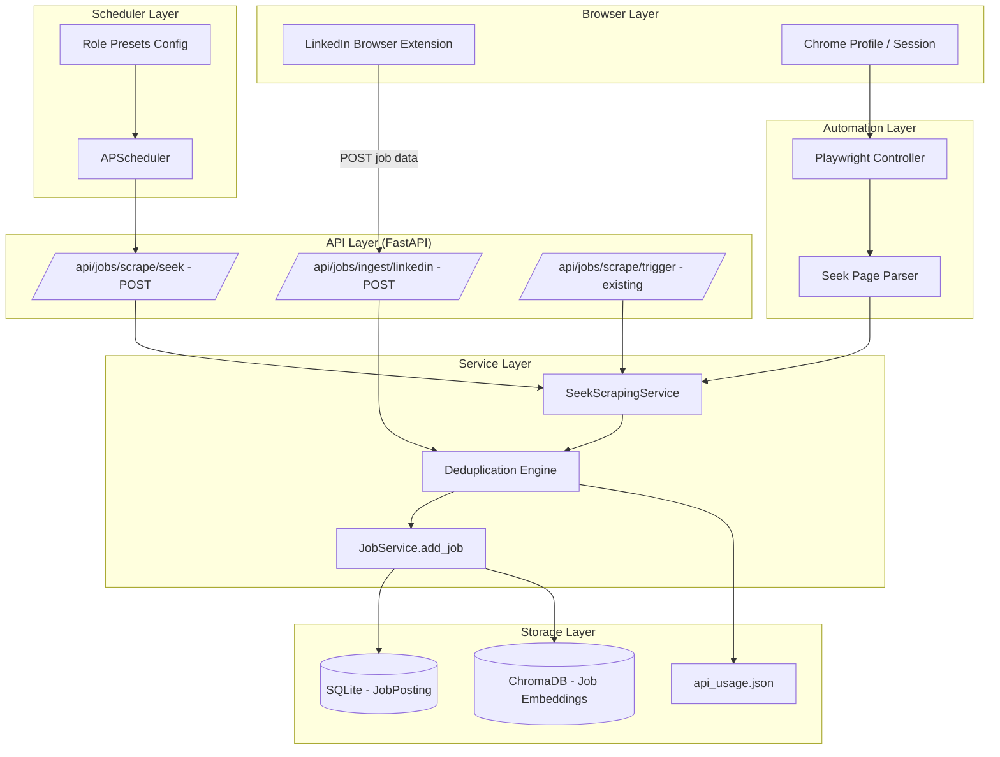
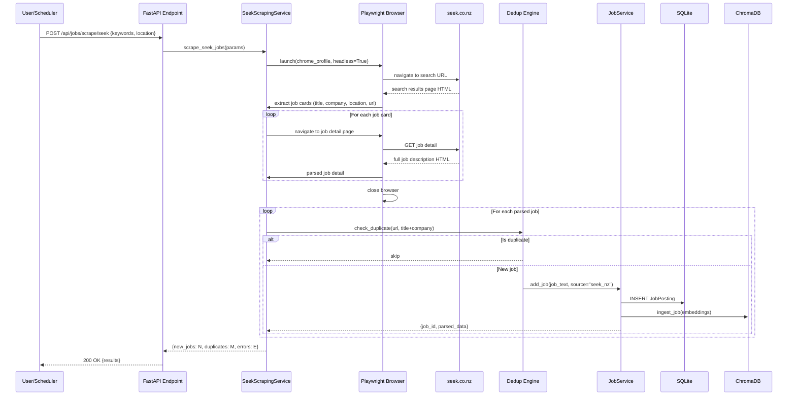
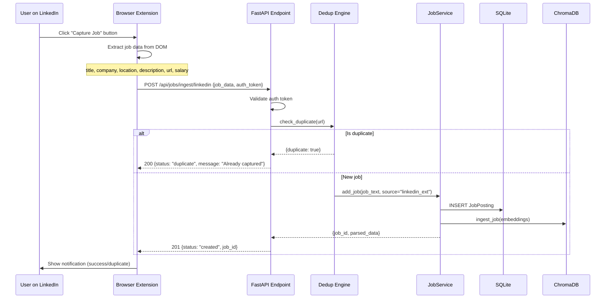
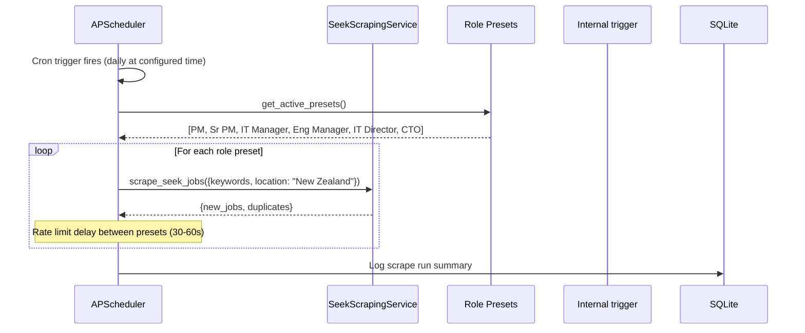

# Design Document: Multi-Source Job Fetching (Seek Automation + LinkedIn Extension)

## Overview

This feature adds two new job ingestion sources to the existing AI Career Agent application: (1) automated Seek.co.nz browsing via Playwright using the user's existing Chrome profile/session, and (2) a lightweight LinkedIn browser extension/bookmarklet that captures job data from the current page and POSTs it to the app's API. A third phase adds scheduled daily Seek scraping using APScheduler with configurable role presets.

The design preserves all existing functionality (Adzuna API, manual job entry, job matching, RAG ingestion) by extending the established adapter pattern and storage pipeline (`JobService.add_job()` → `JobPosting` model → ChromaDB RAG). Each new source integrates through the same deduplication and API usage tracking infrastructure.

The target audience is a single-user deployment in New Zealand, searching for senior IT leadership roles (PM, Engineering Manager, IT Director, CTO) on seek.co.nz.

## Architecture



## Sequence Diagrams

### Phase 1: Seek Automation via Playwright



### Phase 2: LinkedIn Browser Extension



### Phase 3: Scheduled Seek Scraping



## Components and Interfaces

### Component 1: SeekScrapingService

**Purpose**: Manages Playwright-based browsing of seek.co.nz, parsing search results and individual job pages using the user's Chrome profile.

**Interface**:
```python
class SeekScrapingService:
    """Playwright-based Seek.co.nz job scraper using user's Chrome profile."""

    def __init__(self, chrome_profile_path: str | None = None, headless: bool = True):
        ...

    async def scrape_jobs(self, search_params: SeekSearchParams) -> SeekScrapeResult:
        """Scrape job listings from seek.co.nz search results."""
        ...

    async def scrape_job_detail(self, job_url: str) -> SeekJobDetail | None:
        """Navigate to a single job page and extract full details."""
        ...

    async def close(self) -> None:
        """Clean up Playwright browser resources."""
        ...
```

**Responsibilities**:
- Launch Playwright with user's Chrome profile (persistent session, cookies)
- Navigate seek.co.nz search pages with keyword/location parameters
- Parse job cards from search result pages
- Navigate to individual job detail pages for full descriptions
- Handle pagination (configurable max pages)
- Implement human-like delays between requests (2-5 seconds random)
- Return structured job data for the storage pipeline

### Component 2: SeekPageParser

**Purpose**: Extracts structured job data from Seek HTML pages (both search results and individual job pages).

**Interface**:
```python
class SeekPageParser:
    """Parses seek.co.nz HTML into structured job data."""

    def parse_search_results(self, page_html: str) -> list[SeekJobCard]:
        """Extract job cards from a search results page."""
        ...

    def parse_job_detail(self, page_html: str, job_url: str) -> SeekJobDetail:
        """Extract full job details from a single job page."""
        ...

    def build_search_url(self, params: SeekSearchParams) -> str:
        """Construct seek.co.nz search URL from parameters."""
        ...
```

**Responsibilities**:
- Parse Seek's HTML structure for job cards (title, company, location, salary, URL)
- Extract full job descriptions from detail pages
- Handle variations in Seek's page structure (graceful fallbacks)
- Build properly formatted search URLs for seek.co.nz

### Component 3: LinkedIn Ingest API Endpoint

**Purpose**: Receives job data POSTed by the browser extension and stores it through the existing pipeline.

**Interface**:
```python
@router.post("/api/jobs/ingest/linkedin")
async def ingest_linkedin_job(
    request: LinkedInJobIngestRequest,
    db_session: AsyncSession = Depends(get_db),
    user: User = Depends(require_user),
) -> LinkedInJobIngestResponse:
    """Receive and store a LinkedIn job captured by the browser extension."""
    ...
```

**Responsibilities**:
- Validate incoming job data from the extension
- Authenticate the request (JWT token)
- Check for duplicates (by URL and title+company hash)
- Store via `JobService.add_job()` pipeline
- Return status to the extension (created/duplicate/error)

### Component 4: LinkedIn Browser Extension

**Purpose**: Content script + popup that extracts job data from the current LinkedIn job page and sends it to the app API.

**Interface** (TypeScript):
```typescript
interface LinkedInExtension {
  extractJobData(): LinkedInJobData | null;
  sendToApi(jobData: LinkedInJobData): Promise<IngestResponse>;
  showNotification(status: "success" | "duplicate" | "error", message: string): void;
}
```

**Responsibilities**:
- Detect when user is on a LinkedIn job detail page
- Extract job title, company, location, description, URL, salary from DOM
- Show a floating action button or popup to trigger capture
- POST data to the app's `/api/jobs/ingest/linkedin` endpoint
- Display success/error notification
- Store API base URL and auth token in extension settings

### Component 5: SeekScheduledScraper (Enhanced Scheduler)

**Purpose**: Extends the existing `JobScrapingScheduler` to support Seek automation with role presets.

**Interface**:
```python
class SeekScheduledScraper:
    """Scheduled Seek scraping with role preset rotation."""

    def __init__(self, seek_service: SeekScrapingService):
        ...

    async def run_daily_scrape(self) -> dict[str, Any]:
        """Execute scheduled scrape for all active role presets."""
        ...

    def get_active_presets(self) -> list[RolePreset]:
        """Get the configured role presets for scraping."""
        ...
```

**Responsibilities**:
- Iterate through configured role presets at scheduled time
- Apply rate-limiting delays between role searches
- Aggregate results across all preset scrapes
- Log scrape run summaries
- Handle failures gracefully (continue to next preset on error)

## Data Models

### SeekSearchParams

```python
from pydantic import BaseModel, Field
from typing import Optional

class SeekSearchParams(BaseModel):
    """Parameters for a Seek job search."""
    keywords: str = Field(..., description="Search keywords e.g. 'project manager'")
    location: str = Field(default="New Zealand", description="Location filter")
    classification: Optional[str] = Field(default=None, description="Seek classification ID")
    salary_min: Optional[int] = Field(default=None, description="Minimum salary filter")
    salary_max: Optional[int] = Field(default=None, description="Maximum salary filter")
    work_type: Optional[str] = Field(default=None, description="full-time, part-time, contract")
    date_range: Optional[int] = Field(default=None, description="Days since posted (1, 3, 7, 14, 30)")
    max_pages: int = Field(default=3, description="Maximum search result pages to scrape")
    page: int = Field(default=1, description="Starting page number")
```

**Validation Rules**:
- `keywords` must be non-empty
- `max_pages` must be between 1 and 10
- `salary_min` < `salary_max` when both provided
- `date_range` must be one of [1, 3, 7, 14, 30] or None

### SeekJobCard

```python
class SeekJobCard(BaseModel):
    """Job card data extracted from Seek search results."""
    title: str
    company: str
    location: str
    salary_range: Optional[str] = None
    url: str
    posted_date: Optional[str] = None
    classification: Optional[str] = None
    work_type: Optional[str] = None
    is_featured: bool = False
```

### SeekJobDetail

```python
class SeekJobDetail(BaseModel):
    """Full job details from a Seek job detail page."""
    title: str
    company: str
    location: str
    description: str
    salary_range: Optional[str] = None
    url: str
    posted_date: Optional[str] = None
    classification: Optional[str] = None
    sub_classification: Optional[str] = None
    work_type: Optional[str] = None
    requirements: Optional[str] = None
    benefits: Optional[str] = None
    external_id: str  # seek_{job_id}
```

### SeekScrapeResult

```python
class SeekScrapeResult(BaseModel):
    """Result of a Seek scraping operation."""
    source: str = "seek_nz"
    scraped: int = 0
    new_jobs: int = 0
    duplicates: int = 0
    errors: int = 0
    job_ids: list[int] = []
    pages_scraped: int = 0
    search_params: SeekSearchParams
```

### LinkedInJobIngestRequest

```python
class LinkedInJobIngestRequest(BaseModel):
    """Request body for LinkedIn job ingestion from browser extension."""
    title: str = Field(..., min_length=1, max_length=500)
    company: str = Field(..., min_length=1, max_length=500)
    location: Optional[str] = Field(default=None, max_length=500)
    description: str = Field(..., min_length=10)
    url: str = Field(..., pattern=r"^https://(www\.)?linkedin\.com/jobs/")
    salary_range: Optional[str] = None
    seniority_level: Optional[str] = None
    employment_type: Optional[str] = None
    posted_date: Optional[str] = None
```

**Validation Rules**:
- `url` must be a valid LinkedIn job URL
- `description` minimum 10 characters
- `title` and `company` required and non-empty

### LinkedInJobIngestResponse

```python
class LinkedInJobIngestResponse(BaseModel):
    """Response from LinkedIn job ingestion endpoint."""
    status: str  # "created", "duplicate", "error"
    job_id: Optional[int] = None
    message: str
```

### RolePreset

```python
class RolePreset(BaseModel):
    """Configuration for a scheduled role search preset."""
    id: str  # e.g. "project-manager"
    label: str  # e.g. "Project Manager"
    keywords: str  # e.g. "project manager"
    location: str = "New Zealand"
    classification: Optional[str] = None
    enabled: bool = True
    salary_min: Optional[int] = None
```

### Configuration Extensions (Settings)

```python
# Additions to app/core/config.py Settings class
SEEK_CHROME_PROFILE_PATH: str = Field(
    default="",
    description="Path to Chrome user data directory for Seek automation"
)
SEEK_HEADLESS: bool = Field(default=True, description="Run Playwright in headless mode")
SEEK_MAX_PAGES_PER_SEARCH: int = Field(default=3, description="Max result pages per search")
SEEK_REQUEST_DELAY_MIN: float = Field(default=2.0, description="Min delay between requests (seconds)")
SEEK_REQUEST_DELAY_MAX: float = Field(default=5.0, description="Max delay between requests (seconds)")
SEEK_DAILY_SCRAPE_HOUR: int = Field(default=7, description="Hour for daily Seek scrape (NZ time)")
SEEK_DAILY_SCRAPE_MINUTE: int = Field(default=0, description="Minute for daily Seek scrape")
SEEK_ROLE_PRESETS: str = Field(
    default="project-manager,sr-project-manager,it-manager,engineering-manager,it-director,cto",
    description="Comma-separated role preset IDs for scheduled scraping"
)
LINKEDIN_EXTENSION_ENABLED: bool = Field(default=True, description="Enable LinkedIn extension endpoint")
```

## Algorithmic Pseudocode

### Seek Scraping Algorithm

```python
async def scrape_seek_jobs(params: SeekSearchParams) -> SeekScrapeResult:
    """
    Main algorithm for scraping Seek jobs using Playwright.
    
    PRECONDITIONS:
    - Chrome profile path is valid and accessible
    - seek.co.nz is reachable
    - params.keywords is non-empty
    
    POSTCONDITIONS:
    - All new jobs stored in DB and RAG
    - No duplicate jobs created
    - Browser resources cleaned up
    - Result contains accurate counts
    
    LOOP INVARIANT (page loop):
    - All jobs from pages 1..current_page-1 have been processed
    - result.scraped == total cards extracted so far
    - result.new_jobs + result.duplicates + result.errors == result.scraped
    """
    result = SeekScrapeResult(search_params=params)
    browser = None
    
    try:
        # Step 1: Launch browser with user profile
        browser = await playwright.chromium.launch_persistent_context(
            user_data_dir=settings.SEEK_CHROME_PROFILE_PATH,
            headless=settings.SEEK_HEADLESS,
            args=["--disable-blink-features=AutomationControlled"]
        )
        page = await browser.new_page()
        
        # Step 2: Iterate through search result pages
        for page_num in range(params.page, params.page + params.max_pages):
            # Build URL for current page
            search_url = SeekPageParser.build_search_url(params, page=page_num)
            
            # Navigate with human-like delay
            await page.goto(search_url, wait_until="networkidle")
            await random_delay(settings.SEEK_REQUEST_DELAY_MIN, settings.SEEK_REQUEST_DELAY_MAX)
            
            # Extract job cards from page
            page_html = await page.content()
            job_cards = SeekPageParser.parse_search_results(page_html)
            
            if not job_cards:
                break  # No more results
            
            # Step 3: For each job card, get detail and store
            for card in job_cards:
                try:
                    # Check duplicate before fetching detail
                    if await is_duplicate(card.url):
                        result.duplicates += 1
                        result.scraped += 1
                        continue
                    
                    # Navigate to detail page
                    await page.goto(card.url, wait_until="networkidle")
                    await random_delay(settings.SEEK_REQUEST_DELAY_MIN, settings.SEEK_REQUEST_DELAY_MAX)
                    
                    detail_html = await page.content()
                    job_detail = SeekPageParser.parse_job_detail(detail_html, card.url)
                    
                    # Store through existing pipeline
                    job_text = format_job_text(job_detail)
                    stored = await job_service.add_job(
                        job_text=job_text,
                        source="seek_nz",
                        db_session=db_session
                    )
                    
                    if stored and "job_id" in stored:
                        # Update URL and salary on the record
                        await update_job_metadata(stored["job_id"], job_detail)
                        result.new_jobs += 1
                        result.job_ids.append(stored["job_id"])
                    
                    result.scraped += 1
                    
                except Exception as e:
                    result.errors += 1
                    result.scraped += 1
                    logger.error(f"Error processing Seek job {card.url}: {e}")
            
            result.pages_scraped += 1
    
    finally:
        # Step 4: Clean up browser
        if browser:
            await browser.close()
    
    return result
```

### Deduplication Algorithm

```python
async def is_duplicate(url: str, title: str = "", company: str = "") -> bool:
    """
    Check if a job already exists in the database.
    
    PRECONDITIONS:
    - url is a valid URL string OR title+company are non-empty
    - db_session is active
    
    POSTCONDITIONS:
    - Returns True if job exists, False otherwise
    - No side effects on database
    
    Strategy:
    1. Primary: Match by URL (exact)
    2. Secondary: Match by title + company (fuzzy — same title at same company)
    """
    # Primary check: exact URL match
    if url:
        result = await db_session.execute(
            select(JobPosting).where(JobPosting.url == url)
        )
        if result.scalar_one_or_none():
            return True
    
    # Secondary check: title + company combination
    if title and company:
        result = await db_session.execute(
            select(JobPosting).where(
                JobPosting.title == title,
                JobPosting.company == company,
                JobPosting.is_active == True
            )
        )
        if result.scalar_one_or_none():
            return True
    
    return False
```

### LinkedIn Extension Job Extraction (Content Script)

```typescript
function extractLinkedInJobData(): LinkedInJobData | null {
    /**
     * Extract job data from the current LinkedIn job detail page DOM.
     * 
     * PRECONDITIONS:
     * - User is on a LinkedIn job detail page (URL matches /jobs/view/*)
     * - Page has fully loaded
     * 
     * POSTCONDITIONS:
     * - Returns structured job data or null if extraction fails
     * - No DOM modifications
     */
    
    // Verify we're on a job page
    if (!window.location.href.match(/linkedin\.com\/jobs\/view\//)) {
        return null;
    }
    
    // Extract using multiple selector strategies (LinkedIn changes DOM frequently)
    const title = 
        document.querySelector('.job-details-jobs-unified-top-card__job-title')?.textContent?.trim() ||
        document.querySelector('.t-24.t-bold')?.textContent?.trim() ||
        document.querySelector('h1')?.textContent?.trim() || "";
    
    const company = 
        document.querySelector('.job-details-jobs-unified-top-card__company-name')?.textContent?.trim() ||
        document.querySelector('.jobs-unified-top-card__company-name')?.textContent?.trim() || "";
    
    const location = 
        document.querySelector('.job-details-jobs-unified-top-card__bullet')?.textContent?.trim() ||
        document.querySelector('.jobs-unified-top-card__bullet')?.textContent?.trim() || "";
    
    const description = 
        document.querySelector('.jobs-description__content')?.textContent?.trim() ||
        document.querySelector('#job-details')?.textContent?.trim() || "";
    
    // Salary (may not always be present)
    const salary = 
        document.querySelector('.salary-main-rail__salary-range')?.textContent?.trim() ||
        document.querySelector('[class*="salary"]')?.textContent?.trim() || undefined;
    
    // Seniority level
    const seniorityEl = Array.from(document.querySelectorAll('.description__job-criteria-text'))
        .find(el => el.closest('li')?.textContent?.includes('Seniority'));
    const seniority = seniorityEl?.textContent?.trim() || undefined;
    
    if (!title || !company) {
        return null;  // Insufficient data
    }
    
    return {
        title,
        company,
        location,
        description,
        url: window.location.href.split('?')[0],  // Clean URL without tracking params
        salary_range: salary,
        seniority_level: seniority,
    };
}
```

### Scheduled Scrape Orchestration

```python
async def run_daily_seek_scrape() -> dict:
    """
    Execute scheduled daily Seek scrape for all active role presets.
    
    PRECONDITIONS:
    - Settings.SEEK_SCRAPING_ENABLED is True
    - At least one role preset is enabled
    - Chrome profile is accessible
    
    POSTCONDITIONS:
    - All enabled presets have been searched
    - Results aggregated into summary
    - Errors logged but don't halt execution
    
    LOOP INVARIANT:
    - All presets[0..i-1] have been processed
    - total_new_jobs >= 0
    - Each preset had at least SEEK_REQUEST_DELAY_MIN delay before it
    """
    if not settings.SEEK_SCRAPING_ENABLED:
        return {"status": "disabled"}
    
    presets = get_active_presets()
    total_results = {
        "presets_run": 0,
        "total_new_jobs": 0,
        "total_duplicates": 0,
        "total_errors": 0,
        "per_preset": {}
    }
    
    seek_service = SeekScrapingService(
        chrome_profile_path=settings.SEEK_CHROME_PROFILE_PATH,
        headless=settings.SEEK_HEADLESS
    )
    
    for preset in presets:
        if not preset.enabled:
            continue
        
        try:
            params = SeekSearchParams(
                keywords=preset.keywords,
                location=preset.location,
                max_pages=settings.SEEK_MAX_PAGES_PER_SEARCH,
                date_range=1,  # Only jobs from last 24 hours for daily scrape
            )
            
            async with get_async_session_context() as db_session:
                result = await seek_service.scrape_and_store(params, db_session)
            
            total_results["presets_run"] += 1
            total_results["total_new_jobs"] += result.new_jobs
            total_results["total_duplicates"] += result.duplicates
            total_results["per_preset"][preset.id] = {
                "new_jobs": result.new_jobs,
                "duplicates": result.duplicates,
            }
            
        except Exception as e:
            total_results["total_errors"] += 1
            total_results["per_preset"][preset.id] = {"error": str(e)}
            logger.error(f"Error scraping preset {preset.id}: {e}")
        
        # Rate limiting between presets (30-60 seconds)
        await asyncio.sleep(random.uniform(30, 60))
    
    await seek_service.close()
    return total_results
```

## Key Functions with Formal Specifications

### Function 1: SeekScrapingService.scrape_and_store()

```python
async def scrape_and_store(
    self,
    params: SeekSearchParams,
    db_session: AsyncSession
) -> SeekScrapeResult:
    """Scrape Seek jobs and store new ones in the database."""
    ...
```

**Preconditions:**
- `params.keywords` is non-empty string
- `params.max_pages` is between 1 and 10
- `db_session` is an active async session
- Playwright is installed and Chrome/Chromium is available

**Postconditions:**
- Returns `SeekScrapeResult` with accurate counts
- `result.scraped == result.new_jobs + result.duplicates + result.errors`
- All new jobs exist in both SQLite and ChromaDB
- No duplicate jobs created (by URL or title+company)
- Browser context is cleaned up (no resource leaks)

**Loop Invariants:**
- Page loop: `pages_scraped <= max_pages` and all cards from processed pages are accounted for
- Card loop: `scraped` counter increments exactly once per card processed

### Function 2: ingest_linkedin_job()

```python
async def ingest_linkedin_job(
    request: LinkedInJobIngestRequest,
    db_session: AsyncSession,
    user: User,
) -> LinkedInJobIngestResponse:
    """Receive and store a LinkedIn job from the browser extension."""
    ...
```

**Preconditions:**
- `request.url` matches LinkedIn job URL pattern
- `request.title` and `request.company` are non-empty
- `request.description` has at least 10 characters
- `user` is authenticated (valid JWT)

**Postconditions:**
- If duplicate: returns status="duplicate", no DB write
- If new: returns status="created" with valid job_id
- Job stored via `JobService.add_job()` with source="linkedin_ext"
- Job is queryable in ChromaDB RAG after ingestion

### Function 3: is_duplicate()

```python
async def is_duplicate(
    url: str,
    title: str,
    company: str,
    db_session: AsyncSession
) -> bool:
    """Check if a job already exists in the database."""
    ...
```

**Preconditions:**
- At least one of: `url` non-empty, or (`title` non-empty AND `company` non-empty)
- `db_session` is active

**Postconditions:**
- Returns `True` if and only if a matching active JobPosting exists
- No side effects on database state
- URL match takes priority over title+company match

### Function 4: SeekPageParser.parse_job_detail()

```python
def parse_job_detail(self, page_html: str, job_url: str) -> SeekJobDetail:
    """Parse a Seek job detail page into structured data."""
    ...
```

**Preconditions:**
- `page_html` is valid HTML string from a seek.co.nz job page
- `job_url` is the URL of the page

**Postconditions:**
- Returns `SeekJobDetail` with at minimum: title, company, description, url, external_id
- `external_id` format is `seek_{numeric_id}`
- Description is cleaned of HTML tags and normalized whitespace

## Example Usage

### Triggering a Seek scrape from the API

```python
# Manual trigger via API
import httpx

async def trigger_seek_scrape():
    async with httpx.AsyncClient() as client:
        response = await client.post(
            "http://localhost:8000/api/jobs/scrape/seek",
            json={
                "keywords": "engineering manager",
                "location": "Auckland",
                "max_pages": 2,
                "date_range": 7
            },
            headers={"Authorization": "Bearer <token>"}
        )
        result = response.json()
        # {"source": "seek_nz", "new_jobs": 5, "duplicates": 3, "errors": 0}
```

### Using the LinkedIn extension (content script)

```typescript
// content.ts - LinkedIn extension content script
chrome.runtime.onMessage.addListener((msg, sender, sendResponse) => {
    if (msg.action === "captureJob") {
        const jobData = extractLinkedInJobData();
        if (!jobData) {
            sendResponse({ success: false, error: "Could not extract job data" });
            return;
        }
        
        // Get API config from storage
        chrome.storage.sync.get(["apiBaseUrl", "authToken"], async (config) => {
            const response = await fetch(`${config.apiBaseUrl}/api/jobs/ingest/linkedin`, {
                method: "POST",
                headers: {
                    "Content-Type": "application/json",
                    "Authorization": `Bearer ${config.authToken}`,
                },
                body: JSON.stringify(jobData),
            });
            
            const result = await response.json();
            sendResponse({ success: true, result });
        });
        
        return true; // Keep message channel open for async response
    }
});
```

### Scheduler integration

```python
# In app/core/scheduler/job_scheduler.py - extend existing scheduler

async def _scrape_seek_daily(self):
    """Daily Seek scraping with role presets."""
    from app.ingestion.seek_scraper import run_daily_seek_scrape
    
    logger.info("Starting daily Seek scrape...")
    result = await run_daily_seek_scrape()
    logger.info(
        f"Daily Seek scrape complete: {result['total_new_jobs']} new jobs "
        f"across {result['presets_run']} presets"
    )
```

## Correctness Properties

*A property is a characteristic or behavior that should hold true across all valid executions of a system — essentially, a formal statement about what the system should do. Properties serve as the bridge between human-readable specifications and machine-verifiable correctness guarantees.*

### Property 1: No Duplicate Jobs

*For any* job ingested from any source (Seek or LinkedIn extension), there SHALL exist at most one active `JobPosting` record with the same URL OR the same (title, company) combination. Ingesting the same job data a second time SHALL not create a new record.

**Validates: Requirements 6.1, 6.2, 6.3, 6.5**

### Property 2: Pipeline Dual-Write Integrity

*For any* job that passes deduplication and is stored via the Job_Pipeline, that job SHALL exist in both SQLite (`job_postings` table) AND ChromaDB (job embeddings collection). A job cannot exist in one store without the other.

**Validates: Requirements 7.1**

### Property 3: Authentication Required for All Protected Endpoints

*For any* HTTP request to `/api/jobs/ingest/linkedin` or `/api/jobs/scrape/seek` that does not include a valid JWT token, the system SHALL return HTTP 401 Unauthorized regardless of request body content.

**Validates: Requirements 5.2, 10.2**

### Property 4: Source Attribution Correctness

*For any* job stored via the Seek scraper, the `source` field SHALL equal "seek_nz". *For any* job stored via the LinkedIn extension, the `source` field SHALL equal "linkedin_ext". The source field is never empty or misattributed.

**Validates: Requirements 7.2**

### Property 5: Seek Search URL Construction

*For any* valid `SeekSearchParams` (non-empty keywords, max_pages between 1-10, valid optional filters), the constructed search URL SHALL contain all provided parameters in correct seek.co.nz URL format.

**Validates: Requirements 1.2**

### Property 6: Rate Limiting Delay Bounds

*For any* two consecutive HTTP requests to seek.co.nz during a scrape, the delay between them SHALL be at least `SEEK_REQUEST_DELAY_MIN` seconds and at most `SEEK_REQUEST_DELAY_MAX` seconds. *For any* two consecutive role preset scrapes in a scheduled run, the delay SHALL be between 30 and 60 seconds.

**Validates: Requirements 3.1, 8.2**

### Property 7: Result Counting Invariant

*For any* scrape operation returning a `SeekScrapeResult`, the invariant `scraped == new_jobs + duplicates + errors` SHALL hold. Each processed job card increments exactly one of the three outcome counters.

**Validates: Requirements 11.1, 11.2**

### Property 8: Scheduler Preset Isolation

*For any* set of role presets where one or more presets fail during scheduled scraping, all remaining presets SHALL still execute. A failure in preset N does not prevent execution of presets N+1 through the end.

**Validates: Requirements 8.4**

### Property 9: LinkedIn URL Validation

*For any* URL submitted to the LinkedIn ingest endpoint that does NOT match the pattern `^https://(www\.)?linkedin\.com/jobs/`, the endpoint SHALL reject the request with HTTP 422. *For any* URL that does match, it SHALL be accepted (assuming other fields are valid).

**Validates: Requirements 5.4**

### Property 10: External ID Format

*For any* Seek job URL containing a numeric job ID, the derived external_id SHALL be formatted as "seek_{numeric_id}" where numeric_id is extracted from the URL path.

**Validates: Requirements 2.3**

### Property 11: HTML Stripping Idempotence

*For any* HTML string processed by the description cleaner, the output SHALL contain no HTML tags and SHALL have normalized whitespace. Applying the cleaner a second time to its own output SHALL produce an identical result (idempotent).

**Validates: Requirements 2.5**

### Property 12: Deduplication Has No Side Effects

*For any* deduplication check performed against the database, the database state (all records, all fields) SHALL remain unchanged after the check completes. Dedup is a read-only operation.

**Validates: Requirements 6.4**

### Property 13: LinkedIn URL Canonicalization

*For any* LinkedIn job URL containing query parameters or fragment identifiers, the LinkedIn_Extension extraction SHALL produce a clean URL consisting only of the path (no `?` or `#` suffixes).

**Validates: Requirements 4.7**

### Property 14: Input Validation Rejection

*For any* `LinkedInJobIngestRequest` where the description contains fewer than 10 characters, the LinkedIn ingest endpoint SHALL return HTTP 422. *For any* request with empty title or empty company, the endpoint SHALL return HTTP 422.

**Validates: Requirements 5.5**

### Property 15: Pagination Respects Max Pages

*For any* `SeekSearchParams` with a configured `max_pages` value between 1 and 10, the Seek_Scraper SHALL never fetch more than `max_pages` search result pages, regardless of how many results exist.

**Validates: Requirements 1.4**

### Property 16: Active Preset Filtering

*For any* set of role presets with mixed `enabled` flags, requesting active presets SHALL return only those where `enabled` is True and SHALL exclude all presets where `enabled` is False.

**Validates: Requirements 9.2**

### Property 17: Scheduled Scrape Result Aggregation

*For any* collection of per-preset scrape results, the aggregated summary's `total_new_jobs` SHALL equal the sum of all presets' `new_jobs`, `total_duplicates` SHALL equal the sum of all `duplicates`, and `total_errors` SHALL equal the sum of all `errors`.

**Validates: Requirements 8.5**

### Property 18: Valid Job Storage Round-Trip

*For any* valid job ingested through the LinkedIn endpoint with source "linkedin_ext", querying the database by the returned `job_id` SHALL produce a record whose title, company, and source match the ingested data.

**Validates: Requirements 5.6, 7.3**

### Property 19: Rate Limit Enforcement

*For any* sequence of more than 10 requests to `/api/jobs/ingest/linkedin` within a 60-second window from the same authenticated user, requests beyond the 10th SHALL be rejected with a rate-limiting response.

**Validates: Requirements 12.4**

## Error Handling

### Error Scenario 1: Seek Bot Detection / CAPTCHA

**Condition**: Seek returns a CAPTCHA page or blocks the automated browser
**Response**: Log warning, abort current scrape, return partial results
**Recovery**: User switches to non-headless mode; increases delay settings; manually completes CAPTCHA in browser profile before next automated run

### Error Scenario 2: Chrome Profile Lock

**Condition**: Chrome profile is already in use (user has Chrome open with same profile)
**Response**: Raise `BrowserProfileLocked` error, do not launch Playwright
**Recovery**: API returns 409 Conflict with message asking user to close Chrome or use a separate profile. Scheduler retries after 5 minutes.

### Error Scenario 3: LinkedIn Extension Auth Failure

**Condition**: Extension sends request with expired/invalid JWT
**Response**: Return 401 with clear error message
**Recovery**: Extension shows "Session expired" notification and prompts user to re-authenticate in settings

### Error Scenario 4: Seek Page Structure Change

**Condition**: Parser cannot find expected selectors in Seek HTML
**Response**: Log structured warning with the HTML snippet that failed, return partial results
**Recovery**: Parser uses multiple fallback selectors. If all fail, the job card is skipped and counted in `errors`. Admin can review logs to update selectors.

### Error Scenario 5: Playwright Not Installed

**Condition**: Playwright browsers not installed on system
**Response**: Raise clear error at startup/first-use with installation instructions
**Recovery**: Return 503 with message: "Seek scraping unavailable. Run: playwright install chromium"

### Error Scenario 6: Database Connection Failure During Scrape

**Condition**: SQLite becomes unavailable mid-scrape
**Response**: Log error, abort remaining jobs in batch, return partial results
**Recovery**: Jobs already stored are committed. Remaining jobs will be picked up on next scrape run (dedup prevents re-processing stored ones).

## Testing Strategy

### Unit Testing Approach

- **SeekPageParser**: Test with saved HTML fixtures from actual Seek pages. Verify extraction of all fields. Test with malformed HTML to ensure graceful fallbacks.
- **Deduplication**: Test URL matching, title+company matching, and edge cases (URL with/without trailing slash, case sensitivity).
- **LinkedInJobIngestRequest validation**: Test Pydantic model validation with valid/invalid URLs, empty fields, edge cases.
- **RolePreset configuration**: Test preset loading, filtering enabled/disabled, keyword construction.

### Property-Based Testing Approach

**Property Test Library**: hypothesis (Python)

- **Property: Dedup idempotency** — Ingesting the same job data twice always results in exactly one DB record.
- **Property: Result counting invariant** — For any scrape result, `scraped == new_jobs + duplicates + errors`.
- **Property: URL normalization** — Seek URLs with different query parameters but same job ID are recognized as duplicates.
- **Property: Extension payload round-trip** — Any valid `LinkedInJobIngestRequest` serialized to JSON and deserialized back produces identical data.

### Integration Testing Approach

- **End-to-end Seek scrape** (with mocked Playwright): Verify full pipeline from scrape → parse → dedup → store → RAG ingest.
- **LinkedIn extension → API → DB**: Verify POST from extension creates correct JobPosting and is queryable via ChromaDB.
- **Scheduler trigger**: Verify scheduled job fires and executes all enabled presets.
- **Existing regression**: Run existing test suite to confirm no breakage to Adzuna, manual add, matching, etc.

## Performance Considerations

- **Playwright overhead**: Each scrape session launches a browser. For scheduled runs, reuse a single browser context across all presets in one session rather than launching/closing per preset.
- **Seek rate limiting**: Random delays of 2-5 seconds between pages. 30-60 seconds between different role preset searches. These are conservative to avoid detection.
- **Job detail page fetching**: For search results scraping, consider extracting only job cards on the first pass and skipping detail page navigation unless explicitly requested. This reduces page loads from N*M to N.
- **ChromaDB batch ingestion**: When ingesting multiple jobs from a single scrape run, batch the RAG embeddings rather than ingesting one-by-one.
- **Extension latency**: The browser extension should show immediate UI feedback and handle the API call asynchronously so the user isn't blocked.

## Security Considerations

- **JWT authentication**: All new endpoints require valid JWT. The LinkedIn extension stores the token in `chrome.storage.sync` (encrypted by Chrome).
- **Chrome profile isolation**: The Seek automation uses the user's own Chrome profile. This means their existing login session is used — no credentials stored in the app config. However, if the Chrome profile is shared, this is a risk.
- **Extension permissions**: The LinkedIn extension requests minimal permissions: `activeTab` (only current tab), `storage` (for config), and host permission only for the app's API URL.
- **Input sanitization**: All job descriptions from Seek/LinkedIn are treated as untrusted input. HTML is stripped before storage. SQL injection prevented by SQLAlchemy's parameterized queries.
- **No credential storage for LinkedIn**: Unlike the existing `LinkedInAdapter` which stores email/password, the extension approach means LinkedIn credentials are never touched by the app.
- **Rate limiting**: The extension endpoint should be rate-limited (e.g., max 10 requests per minute) to prevent abuse even with valid tokens.

## Dependencies

### New Python Dependencies
- `playwright` — Browser automation for Seek scraping (async API)
- `playwright` browsers: `playwright install chromium`

### Browser Extension (separate build)
- Chrome Extension Manifest V3
- No external NPM dependencies (vanilla TypeScript/JS)
- Built as a standalone artifact in `extension/` directory

### Existing Dependencies (unchanged)
- `fastapi`, `sqlalchemy[asyncio]`, `aiosqlite` — API and database
- `apscheduler` — Scheduling
- `chromadb`, `sentence-transformers` — RAG
- `beautifulsoup4` — HTML parsing (already installed, used by SeekPageParser)
- `pydantic` — Data validation
